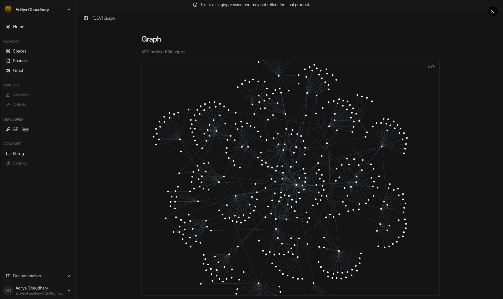

<div align="center">

# `@crosmos/graph`

**Force-directed knowledge-graph rendering for React.**
Cluster-aware out of the box. Bring your own data — feed `<ForceGraph>` two arrays and you're done.

<br />

[](https://www.npmjs.com/package/@crosmos/graph)
[](https://www.npmjs.com/package/@crosmos/graph)
[](./LICENSE)

[Install](#install) · [Quickstart](#quickstart) · [Props](#props) · [Theme](#theme) · [SSR](#ssr--nextjs)

</div>



## Install

```bash
npm install @crosmos/graph react react-dom react-force-graph-2d
```

> [!NOTE]
> `react`, `react-dom`, and `react-force-graph-2d` are peer dependencies — install them in the host app so you don't end up with duplicates.


## Quickstart

```tsx
import { ForceGraph, type BaseNode, type BaseEdge } from "@crosmos/graph";
import "@crosmos/graph/styles.css";

interface MyNode extends BaseNode { label: string; team: string; }
interface MyEdge extends BaseEdge { label: string; }

export function MyGraph({ nodes, edges }: { nodes: MyNode[]; edges: MyEdge[] }) {
  return (
    <ForceGraph<MyNode, MyEdge>
      nodes={nodes}
      edges={edges}
      getNodeLabel={(n) => n.label}
      getEdgeLabel={(e) => e.label}
      onNodeClick={(n) => console.log("clicked", n.team)}
    />
  );
}
```

The package only exposes generic shapes — `BaseNode { id }` and `BaseEdge { id, source, target }`. Carry your domain fields on the node/edge directly; accessor functions stay fully type-safe. Fetch with TanStack Query / SWR / RSC / anything — the package does no fetching.


## Props

`<ForceGraph<TNode, TEdge>>` accepts:

| Prop                  | Type                                                                                                  | Default               | Description                                                                 |
| --------------------- | ----------------------------------------------------------------------------------------------------- | --------------------- | --------------------------------------------------------------------------- |
| `nodes` *(required)*  | `TNode[]`                                                                                             | —                     | Must extend `BaseNode { id: string }`.                                      |
| `edges` *(required)*  | `TEdge[]`                                                                                             | —                     | Must extend `BaseEdge { id: string; source: string; target: string }`.      |
| `getNodeLabel`        | `(node: TNode) => string`                                                                             | `n.label \|\| n.name \|\| n.id` | Text rendered below each node.                                              |
| `getNodeWeight`       | `(node: TNode) => number`                                                                             | `n.weight ?? 0`       | Drives degree-based collision radius and clustering hub priority.           |
| `getEdgeLabel`        | `(edge: TEdge) => string`                                                                             | `e.label ?? ""`       | Text rendered on the midpoint of the edge. Empty string hides it.           |
| `onNodeClick`         | `(node: TNode) => void`                                                                               | —                     | Fires after the camera centres on the node.                                 |
| `onEdgeClick`         | `(edge: TEdge) => void`                                                                               | —                     | Fires after the camera centres on the edge midpoint.                        |
| `onBackgroundClick`   | `() => void`                                                                                          | —                     | Fires on canvas background click.                                           |
| `theme`               | `Partial<GraphTheme>`                                                                                 | `DEFAULT_THEME`       | Deep-merged with defaults — see [Theme](#theme).                            |
| `disableClustering`   | `boolean`                                                                                             | `false`               | Skip Louvain detection and the cluster force; revert to single-gravity-well layout. |
| `showZoomLevel`       | `false \| "top-right" \| "top-left" \| "bottom-right" \| "bottom-left"`                               | `false`               | Render a live zoom-percentage indicator at the given corner.                |
| `className`           | `string`                                                                                              | `"cg-root"`           | Replaces the container class entirely.                                      |
| `aria-label`          | `string`                                                                                              | `"Knowledge graph"`   | Container `aria-label`.                                                     |
| `emptyState`          | `ReactNode`                                                                                           | "No entities to display" | Rendered when `nodes` is empty and `isLoading` is falsy.                    |
| `loadingState`        | `ReactNode`                                                                                           | —                     | Rendered while the canvas lib is dynamic-imported, or when `nodes` is empty and `isLoading` is true. |
| `isLoading`           | `boolean`                                                                                             | —                     | Sets `aria-busy` on the container.                                          |
| `ref`                 | `Ref<ForceGraphHandle>`                                                                               | —                     | Imperative handle — see below.                                              |

### Imperative handle

```tsx
const ref = useRef<ForceGraphHandle>(null);
// ...
<ForceGraph ref={ref} {...} />
```

| Method            | Signature                                                | Description                                            |
| ----------------- | -------------------------------------------------------- | ------------------------------------------------------ |
| `zoom`            | `(scale: number, durationMs?: number) => void`           | Animate to an absolute zoom level.                     |
| `zoomToFit`       | `(durationMs?: number, paddingPx?: number) => void`      | Fit all nodes in view.                                 |
| `centerAt`        | `(x: number, y: number, durationMs?: number) => void`    | Pan to graph coordinates.                              |
| `pauseAnimation`  | `() => void`                                             | Stop the simulation.                                   |
| `resumeAnimation` | `() => void`                                             | Resume the simulation.                                 |
| `refresh`         | `() => void`                                             | Force a single canvas repaint.                         |


## Theme

Pass any subset of `GraphTheme` to `theme`. Deep-merged with [`DEFAULT_THEME`](./src/constants/graph.ts).

```tsx
<ForceGraph
  theme={{
    node:    { color: "#0ea5e9", hoverColor: "#f97316" },
    link:    { defaultAlpha: 0.55, dimRgbTuple: "100,116,139" },
    cluster: { intraLinkDistance: 100, interLinkDistance: 320, strength: 0.22 },
    label:   { zoomGrowthCap: 2 },
  }}
  {...rest}
/>
```

<details>
<summary><strong>Full theme reference</strong> (click to expand)</summary>

#### `theme.node`

| Key         | Type     | Default                       | Description                                |
| ----------- | -------- | ----------------------------- | ------------------------------------------ |
| `radius`    | `number` | `4`                           | Visible node radius in graph units.        |
| `fontSize`  | `number` | `8`                           | Label font size at zoom 1×.                |
| `labelGap`  | `number` | `3`                           | Vertical gap between node and label.       |
| `labelColor`| `string` | `oklch(0.95 0 0)`             | Label text colour.                         |
| `color`     | `string` | `#ffffff`                     | Default fill.                              |
| `hoverColor`| `string` | `oklch(0.5544 0.1146 158.24)` | Fill while hovered.                        |

#### `theme.link`

| Key                 | Type     | Default                      | Description                                       |
| ------------------- | -------- | ---------------------------- | ------------------------------------------------- |
| `color`             | `string` | `rgba(148,163,184,0.4)`      | Line colour at rest.                              |
| `defaultAlpha`      | `number` | `0.4`                        | Alpha at rest (used to derive the dimmed state).  |
| `defaultWidth`      | `number` | `0.5`                        | Line width at rest.                               |
| `highlightedWidth`  | `number` | `1.5`                        | Line width while highlighted.                     |
| `curvatureSpacing`  | `number` | `0.25`                       | Curvature applied to parallel edges.              |
| `dimRgbTuple`       | `string` | `"148,163,184"`              | RGB tuple used to build the dimmed `rgba(...)`.   |

#### `theme.edge`

| Key                    | Type     | Default       | Description                          |
| ---------------------- | -------- | ------------- | ------------------------------------ |
| `fontSize`             | `number` | `6`           | Edge label size at zoom 1×.          |
| `labelPaddingX`        | `number` | `3`           | Horizontal padding of label rect.    |
| `labelPaddingY`        | `number` | `1`           | Vertical padding of label rect.      |
| `labelBackgroundColor` | `string` | `transparent` | Background fill of the label rect.   |

#### `theme.label`

| Key               | Type     | Default | Description                                                                    |
| ----------------- | -------- | ------- | ------------------------------------------------------------------------------ |
| `opacityMinZoom`  | `number` | `1.2`   | Zoom at which labels start fading in.                                          |
| `opacityMaxZoom`  | `number` | `1.7`   | Zoom at which labels reach full opacity.                                       |
| `zoomGrowthCap`   | `number` | `3`     | Above this zoom, labels stop growing in screen pixels and zoom de-clutters.    |

#### `theme.hover`

| Key                     | Type     | Default | Description                                       |
| ----------------------- | -------- | ------- | ------------------------------------------------- |
| `labelShiftY`           | `number` | `2`     | Vertical shift when hovered.                      |
| `hiddenLabelOpacity`    | `number` | `1`     | Target opacity for labels that were hidden.       |
| `animationDurationMs`   | `number` | `150`   | Fade-in / fade-out duration.                      |
| `highlightOpacityBoost` | `number` | `0.6`   | Floor for label opacity while hovered.            |
| `dimOpacity`            | `number` | `0.15`  | Multiplier applied to non-hovered nodes.          |

#### `theme.force`

| Key                | Type     | Default | Description                                              |
| ------------------ | -------- | ------- | -------------------------------------------------------- |
| `linkDistance`     | `number` | `120`   | Fallback target link length when clustering is disabled. |
| `chargeStrength`   | `number` | `-250`  | `forceManyBody` strength (negative = repulsion).         |
| `chargeDistanceMax`| `number` | `500`   | Maximum distance over which charge applies.              |
| `alphaDecay`       | `number` | `0.015` | Simulation cooldown rate.                                |
| `velocityDecay`    | `number` | `0.6`   | Per-tick velocity damping.                               |
| `boundaryStrength` | `number` | `0.01`  | `forceX`/`forceY` strength pulling toward (0, 0).        |

#### `theme.cluster`

| Key                 | Type     | Default | Description                                                  |
| ------------------- | -------- | ------- | ------------------------------------------------------------ |
| `intraLinkDistance` | `number` | `120`   | Target link length between two nodes in the same community.  |
| `interLinkDistance` | `number` | `280`   | Target link length for cross-community bridges.              |
| `strength`          | `number` | `0.14`  | Centroid pull strength (`alpha`-scaled on top of this).      |

#### `theme.click` / `theme.edgeClick`

| Key                       | Type     | Default | Description                              |
| ------------------------- | -------- | ------- | ---------------------------------------- |
| `centerAnimationDuration` | `number` | `300`   | Pan animation duration (ms).             |
| `targetZoom`              | `number` | `2`     | Zoom level after a node/edge click.      |
| `animationDuration`       | `number` | `300`   | (edgeClick) Pan animation duration (ms). |
| `padding`                 | `number` | `80`    | (edgeClick) Padding around the edge.     |

#### `theme.fontFamily`

| Key          | Type     | Default                                          |
| ------------ | -------- | ------------------------------------------------ |
| `fontFamily` | `string` | `Satoshi, Inter, ui-sans-serif, system-ui, sans-serif` |

</details>

### CSS variables (zoom indicator)

Override on `.cg-root`. The package only styles the container and the optional zoom indicator — everything inside the canvas is painted via theme values, not CSS.

| Variable         | Default (light)            | Purpose                          |
| ---------------- | -------------------------- | -------------------------------- |
| `--cg-muted-fg`  | `oklch(0.35 0.02 99.4974)` | Empty-state / zoom-label colour. |
| `--cg-zoom-bg`   | `transparent`              | Zoom indicator background.       |
| `--cg-zoom-fg`   | `var(--cg-muted-fg)`       | Zoom indicator text.             |

The zoom indicator picks up `cg-zoom-label--{position}` modifier classes — override any of them in your own CSS to retarget placement.


## Clustering

Enabled by default. On each `nodes`/`edges` change, the renderer runs [Louvain community detection](https://en.wikipedia.org/wiki/Louvain_method) and feeds the result into the simulation as:

- **Variable link distance** — intra-community links pull to `theme.cluster.intraLinkDistance` (120 by default); inter-community bridges pull to `theme.cluster.interLinkDistance` (280).
- **Centroid force** — every tick each node is nudged toward its community's centroid at strength `theme.cluster.strength · alpha`.

Pass `disableClustering` to turn the whole thing off — the rest of the simulation (charge, collision, link spring) is untouched.

> [!TIP]
> Bundle impact: `graphology` + `graphology-communities-louvain` add ~60 KB gzipped. Both are bundled into the package — no peer.


## Mock data for development

```ts
import { MOCK_NODES, MOCK_EDGES } from "@crosmos/graph/mock";
```

500 nodes / ~550 edges of production-faithful data — single `USER` hub, the 7 canonical entity types (`person`, `organization`, `technology`, `project`, `concept`, `location`, `object`), the 23-relation canonical vocabulary, bimodal confidence, deterministic across loads. Useful for stress-testing the renderer or screenshots.


## Sub-path exports

| Import path                 | What's there                                                                                  |
| --------------------------- | --------------------------------------------------------------------------------------------- |
| `@crosmos/graph`            | `ForceGraph`, `BaseNode`, `BaseEdge`, theme types, `DEFAULT_THEME`, `mergeTheme`.             |
| `@crosmos/graph/mock`       | 500-node mock dataset.                                                                        |
| `@crosmos/graph/styles.css` | Container + zoom-indicator default styles.                                                    |


## SSR / Next.js

The renderer wraps `react-force-graph-2d`, which is canvas-based and client-only. `<ForceGraph>` is marked `"use client"` and dynamic-imports the lib internally, so it's safe to mount inside Next.js server components — the container will render its `loadingState` (or nothing) on the server and hydrate on the client.

> [!IMPORTANT]
> Don't import `@crosmos/graph` from a server-only module. It needs the browser to actually draw.


## Browser support

Modern evergreen browsers — Chrome / Edge / Firefox / Safari latest two majors. The CSS defaults use `oklch()` color (Chrome ≥ 111, Safari ≥ 15.4, Firefox ≥ 113).


## License

[MIT](./LICENSE) © [Crosmos Labs](https://crosmos.dev)
